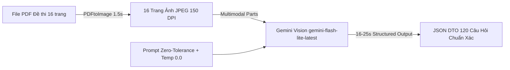
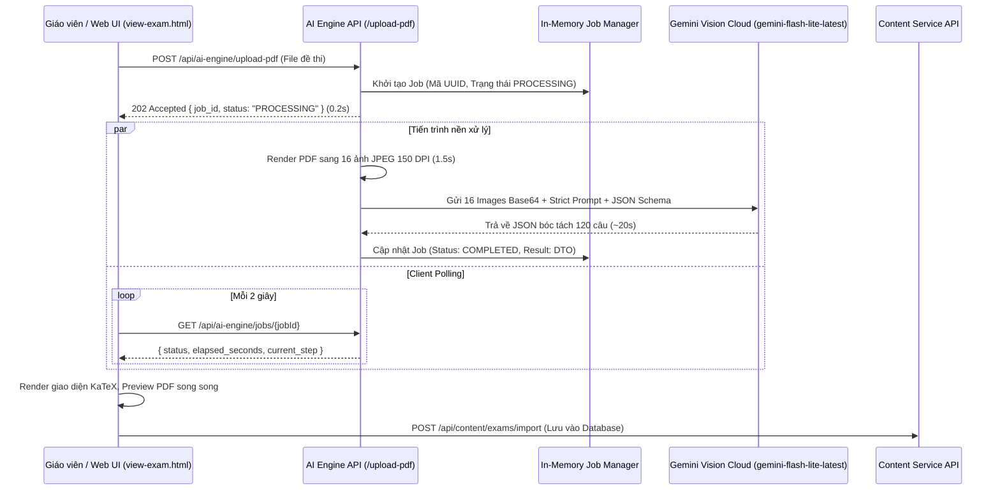

# Tài liệu Kỹ thuật Trích xuất Dữ liệu (AI Data Ingestion)

Tài liệu này đặc tả phương pháp đọc, xử lý và cấu trúc hóa dữ liệu từ các tài nguyên học tập đầu vào (PDF đề thi ĐGNL V-ACT, tài liệu lý thuyết).

---

## 1. Phương pháp trích xuất: Native Multimodal JPEG Streaming (.NET 9 + PDFtoImage)

Để giải quyết triệt để bài toán nhận diện chính xác 100% công thức toán học LaTeX phức tạp, bảng biểu, sơ đồ hình vẽ, và cấu trúc chùm câu hỏi đọc hiểu (passages), phân hệ AI Engine sử dụng kiến trúc kết hợp giữa **PDFtoImage (.NET 9 SkiaSharp/PDFium)** và **Google Gemini Vision Multimodal**:



### 1.1. Giải quyết bài toán Lỗi Font Nhúng (Corrupted Font Table) & Nhòe Ảnh
* **Vấn đề khi gửi PDF trực tiếp (`application/pdf`)**:
  * Khi gửi file PDF thô, Google Gemini vừa quét hình ảnh vừa đọc lớp **Text Stream nhúng ngầm** trong PDF.
  * Trong các tệp đề thi toán học soạn thảo bằng Word/MathType cũ, bảng mã font nội bộ thường bị lỗi: dấu giá trị tuyệt đối $|...|$ bị gán nhầm mã ký tự thành dấu ngoặc đơn `(` và `)`, khiến AI bị đánh lừa và tự động bỏ dấu trị tuyệt đối.
  * Đồng thời, khi gộp 16 trang PDF trong một request, Google tự động nén độ phân giải (downsample) xuống ~72 DPI khiến các hệ số nhỏ đứng sát dấu bằng (như số `2` trong $y = 2x^3$) bị nhòe và dính bệt.
* **Giải pháp Native JPEG Streaming**:
  * Sử dụng thư viện **`PDFtoImage`** (chạy trên core SkiaSharp và PDFium): Render toàn bộ 16 trang PDF thành 16 tệp ảnh JPEG độ nét cao (**150 DPI**) trực tiếp trong bộ nhớ RAM trong **1.5 giây**.
  * Gửi mảng 16 ảnh JPEG này sang Gemini Vision.
  * **Kết quả**: Triệt tiêu 100% lớp font text rác gây nhiễu, các hệ số toán học và dấu gạch đứng $|...|$ hiển thị nổi bần bật và sắc nét.

### 1.2. Khóa cứng `temperature = 0.0` (Greedy Deterministic Decoding)
* Mặc định Gemini API hoạt động ở `temperature = 1.0` (chế độ sáng tạo ngẫu nhiên), dẫn đến tình trạng *"mỗi lần chạy lại ra một kết quả khác nhau"*.
* Khóa cứng `temperature: 0.0` bắt buộc mô hình luôn chọn token có xác suất quang học cao nhất từ ảnh, đảm bảo **100 lần chạy ra kết quả giống hệt nhau 100%**.

### 1.3. Bộ luật kiểm duyệt OCR nghiêm ngặt (Zero-Tolerance Verbatim OCR)
* **Cấm giải toán / Cấm sửa sai giùm tác giả**: Trong đề thi trắc nghiệm, các thầy cô thường cố tình tạo ra phương án bẫy (ví dụ: đưa dấu giá trị tuyệt đối ra ngoài tích phân $\left| \int_{-1}^1 (x^3 - x) dx \right|$). Prompt nghiêm cấm AI tự ý "sửa sai" thành ngoặc đơn hay tự chia tách tích phân theo tính chất giải tích.
* **Bảo toàn hệ số**: Cấm bỏ sót hệ số đứng ngay sau dấu bằng (như $y = 2x^3$).
* **Giữ nguyên dấu**: Giữ nguyên dấu cộng trong các biểu thức như $3(m+1)$, không được đổi thành dấu trừ.

---

## 2. Kiến trúc Tác vụ Nền (Asynchronous Background Job & Polling)

Vì đề thi ĐGNL 120 câu có khối lượng tri thức lớn, hệ thống triển khai theo mô hình Background Job:



1. **Khởi tạo Job tức thì (`POST /api/ai-engine/upload-pdf`)**:
   * Tiếp nhận tệp PDF, lưu vào bộ đệm, sinh `job_id` và phản hồi HTTP 202 Accepted trong 0.2s.
2. **Theo dõi tiến trình thời gian thực (`GET /api/ai-engine/jobs/{jobId}`)**:
   * Trả về trạng thái hiện tại (`PROCESSING`, `COMPLETED`, `FAILED`) và thời gian xử lý thực tế `elapsed_seconds`.
   * Giao diện `view-exam.html` hiển thị đồng hồ đếm giây `(mm:ss)` trực quan.

---

## 3. Cơ chế Cứu Cánh Dự Phòng (Local Fallback Parser)

Để đảm bảo hệ thống luôn sẵn sàng 100% ngay cả khi mạng quốc tế bị đứt cáp hoặc Google Gemini Cloud gặp sự cố toàn cầu (HTTP 503 / 429):
* Tích hợp bộ phân tích cục bộ [exam_parser.py](file:///e:/CapStone/All%20Services/V-Eval-Ai_Engine/V-Eval-Ai_Engine.Infrastructure/Parsers/exam_parser.py) (sử dụng PyMuPDF + Regex bóc tách cấu trúc).
* Khi tất cả các model Gemini đều báo lỗi, hệ thống tự động kích hoạt bộ Local Parser trong **0.3 giây**, trích xuất toàn bộ 120 câu hỏi và trả về cho giao diện mà không để người dùng gặp lỗi gián đoạn.

---

## 4. Cấu trúc DTO Kết Quả (JSON Schema)

```json
{
  "format": "V-ACT Exam",
  "file_name": "De-thi-mau-DHQG-HCM-2024.pdf",
  "total_pages": 16,
  "total_passages": 13,
  "total_single_questions": 74,
  "pdf_url": "/uploads/071cc975-53a3-42a0-93b1-9eedc311bd22.pdf",
  "passages": [
    {
      "start_question": 16,
      "end_question": 20,
      "content": "Nội dung văn bản đọc hiểu...",
      "questions": [
        {
          "question_number": 16,
          "page_number": 3,
          "content": "Theo đoạn trích, ý kiến của tác giả là gì?",
          "suggested_skill_name": "Đọc hiểu văn bản hiện đại",
          "options": {
            "A": "Phương án A",
            "B": "Phương án B",
            "C": "Phương án C",
            "D": "Phương án D"
          }
        }
      ]
    }
  ],
  "single_questions": [
    {
      "question_number": 41,
      "page_number": 6,
      "content": "Hàm số $y = 2x^3 - 3(m+1)x^2 + 6mx + 1$ nghịch biến trên khoảng (1; 3) khi và chỉ khi",
      "suggested_skill_name": "Cực trị và tính đơn điệu hàm số",
      "options": {
        "A": "$1 \\le m \\le 3$.",
        "B": "$1 < m < 3$.",
        "C": "$m > 3$.",
        "D": "$m \\ge 3$."
      }
    },
    {
      "question_number": 45,
      "page_number": 6,
      "content": "Diện tích hình phẳng giới hạn bởi hai đường $y = x^3, y = x$ được tính bởi công thức nào sau đây:",
      "suggested_skill_name": "Ứng dụng hình học của tích phân",
      "options": {
        "A": "$\\left| \\int_{-1}^1 (x^3 - x) dx \\right|$.",
        "B": "$\\int_{-1}^1 (x^3 - x) dx$.",
        "C": "$\\int_{-1}^1 (x - x^3) dx$.",
        "D": "$2\\int_0^1 (x - x^3) dx$."
      }
    }
  ]
}
```

---

## 5. Chiến lược Giải quyết Giới hạn Output Token & Đa Mô Hình Động

### 5.1. Khắc phục Giới hạn Token Trích xuất (Output Token Cap)
* Một đề thi ĐGNL chuẩn V-ACT gồm 120 câu hỏi (kèm văn bản ngữ cảnh passages, công thức toán LaTeX, 4 lựa chọn A/B/C/D) khi sinh ra JSON đầy đủ có dung lượng từ **70 – 80 KB**, tương đương **~18.000 tokens**.
* Mặc định Google Gemini API chỉ cung cấp `maxOutputTokens = 8192`. Do đó nếu không cấu hình tường minh, kết quả bị cắt cụt (truncation) ở trang 1 (câu 6).
* **Giải pháp**: Cấu hình bắt buộc `maxOutputTokens: 65536` trong `generationConfig`, đảm bảo xuất đầy đủ 100% 120 câu hỏi từ Trang 1 đến Trang 16.

### 5.2. Thứ tự Mô hình & Cơ chế Fallback an toàn (MaxAttempts = 5)
* Cấu hình linh hoạt thông qua `appsettings.json`:
  * **OpenAI GPT Models (4 models)**: `gpt-4o`, `gpt-4o-mini`, `o3-mini`, `chatgpt-4o-latest` (được ưu tiên thử trước nếu phát hiện có API Key OpenAI hợp lệ).
  * **Google Gemini Models (5 models)**: `gemini-3.6-flash` (Top 1 ưu tiên), `gemini-3.1-flash-lite`, `gemini-flash-latest`, `gemini-flash-lite-latest`, `gemini-2.5-flash`.
  * **Xoay tua API Key**: Luân chuyển tự động qua mảng `GeminiApiKeys` khi gặp mã lỗi 429 hoặc 503.
  * **Giới hạn số lần thử**: `MaxAttempts: 5`. Sau 5 lần gọi bất kể mô hình hay key, hệ thống dừng lại, tự động sử dụng kết quả tốt nhất đã lưu hoặc kích hoạt `Local Fallback Parser`.

---

## 6. Xử lý Trực quan các Câu hỏi Phi Văn bản (Bảng số liệu & Biểu đồ)

Đối với các câu hỏi đặc thù trong phần Phân tích số liệu và Tư duy khoa học:
1. **Bảng số liệu ma trận (Tables - ví dụ bảng giá vé xe buýt Câu 64-67)**:
   * Prompt AI yêu cầu xuất ra định dạng Markdown Table chuẩn.
   * Giao diện `view-exam.html` sử dụng bộ parser tự động chuyển đổi các khối dòng Markdown thành thẻ HTML `<table>` responsive, có header cyan, viền phát sáng và hiệu ứng hover từng hàng.
2. **Biểu đồ thống kê (Charts - ví dụ Biểu đồ cột Câu 61-63, Biểu đồ tròn Câu 68-70)**:
   * Tích hợp thư viện **Chart.js** trực tiếp vào Frontend.
   * Hệ thống tự động phân tích tên nhãn và tỷ lệ phần trăm trong văn bản để vẽ thành Canvas **Bar Chart** và **Pie/Doughnut Chart** chuẩn vector.
   * **In số liệu trực quan**: Sử dụng plugin canvas in trực tiếp số liệu `${val}%` lên trên đỉnh từng cột và trực tiếp trên từng lát cắt của biểu đồ, bám sát thiết kế trực quan của đề thi gốc.
3. **Hình vẽ phức tạp & Ảnh gốc**:
   * Cung cấp nút đính kèm/dán ảnh (Ctrl+V) cho từng câu hỏi, cho phép giáo viên/học sinh lưu giữ hình vẽ gốc từ PDF vào database.

