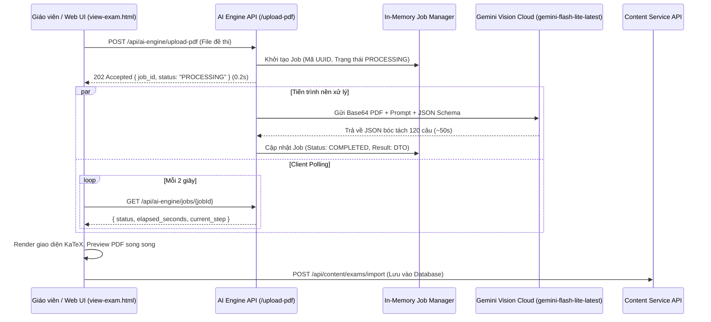

# Tài liệu Kỹ thuật Trích xuất Dữ liệu (AI Data Ingestion)

Tài liệu này đặc tả phương pháp đọc, xử lý và cấu trúc hóa dữ liệu từ các tài nguyên học tập đầu vào (PDF đề thi ĐGNL V-ACT, tài liệu lý thuyết).

---

## 1. Phương pháp trích xuất: Multimodal Gemini Vision (.NET 9 Native)

Để giải quyết triệt để vấn đề nhận diện các công thức toán học LaTeX phức tạp, bảng biểu, sơ đồ hình vẽ, và cấu trúc chùm câu hỏi đọc hiểu (passages), phân hệ AI Engine sử dụng kiến trúc .NET 9 Native Clean Architecture kết nối trực tiếp với Google Gemini Vision:

*   **Mô hình sử dụng**: `gemini-flash-lite-latest` (Ưu tiên hàng đầu - đạt tốc độ cao và ổn định nhất, không bị nghẽn tải hoặc dính lỗi 503).
    *   *Danh sách dự phòng linh hoạt*: `gemini-3.1-flash-lite`, `gemini-3.5-flash`, `gemini-3.6-flash`.
*   **Phương thức truyền tải đa phương thức (Multimodal Vision)**: 
    *   Đọc trực tiếp stream dữ liệu PDF trong bộ nhớ RAM, mã hóa thành Base64 (`application/pdf`).
    *   Gửi trọn vẹn tệp tin PDF gốc lên Google Gemini Vision API, cho phép AI "nhìn" trực quan toàn bộ trang tài liệu: phân biệt câu đơn lập, bảng biểu, biểu đồ gia tốc, đồ thị hàm số và các từ ngữ gạch chân Tiếng Anh (`<u>...</u>`).
*   **Tốc độ xử lý thực nghiệm**: 
    *   Xử lý trọn vẹn đề thi ĐGNL 16 trang (120 câu hỏi) chỉ mất **~50 giây** (thay vì 4 - 6 phút như các mô hình suy luận reasoning nặng nề).
*   **Ràng buộc cấu trúc đầu ra (Structured JSON Schema)**:
    *   Sử dụng tính năng `responseSchema` của Gemini API, ép buộc AI phản hồi chuẩn xác theo schema DTO:
        *   `passages`: Danh sách chùm bài đọc hiểu (ngữ cảnh chung + danh sách câu hỏi con).
        *   `single_questions`: Danh sách câu hỏi độc lập.
        *   `suggested_skill_name`: Gợi ý tên kỹ năng / dạng bài học tập (phục vụ tự động map sang Skills Tree của Content Service).
        *   Toàn bộ công thức toán học, lý hóa bắt buộc được chuẩn hóa sang **LaTeX** bọc trong dấu `$ ... $`.

---

## 2. Kiến trúc Tác vụ Nền (Asynchronous Background Job & Polling)

Vì đề thi ĐGNL 120 câu có khối lượng tri thức lớn, việc giữ kết nối HTTP đồng bộ (Synchronous) dễ dẫn tới timeout trình duyệt. Hệ thống triển khai theo mô hình Background Job:



1. **Khởi tạo Job tức thì (`POST /api/ai-engine/upload-pdf`)**:
   * Tiếp nhận tệp PDF, lưu vào bộ đệm, sinh `job_id` và phản hồi HTTP 202 Accepted trong 0.2s.
2. **Theo dõi tiến trình thời gian thực (`GET /api/ai-engine/jobs/{jobId}`)**:
   * Trả về trạng thái hiện tại (`PROCESSING`, `COMPLETED`, `FAILED`) và thời gian xử lý thực tế `elapsed_seconds`.
   * Giao diện `view-exam.html` hiển thị đồng hồ đếm giây `(mm:ss)` trực quan.
3. **Mở rộng Timeout HttpClient**:
   * Cấu hình `HttpClient.Timeout = TimeSpan.FromMinutes(8)` trong `DependencyInjection.cs`, đảm bảo tiến trình nền chạy bền bỉ không bị ngắt quãng.

---

## 3. Cơ chế Cứu Cánh Dự Phòng (Local Fallback Parser)

Để đảm bảo hệ thống luôn sẵn sàng 100% ngay cả khi mạng quốc tế bị đứt cáp hoặc Google Gemini Cloud gặp sự cố toàn cầu (HTTP 503 / 429):
* Tích hợp bộ phân tích cục bộ [exam_parser.py](file:///e:/CapStone/All%20Services/V-Eval-Ai_Engine/V-Eval-Ai_Engine.Infrastructure/Parsers/exam_parser.py) (sử dụng PyMuPDF + Regex bóc tách cấu trúc).
* Khi tất cả các model Gemini đều báo lỗi, hệ thống tự động kích hoạt bộ Local Parser trong **0.3 giây**, trích xuất toàn bộ 120 câu hỏi và trả về cho giao diện mà không để người dùng gặp lỗi gián đoạn.

---

## 4. Cấu trúc DTO Kết Quả (JSON Schema)

```json
{
  "format": "V-ACT Exam",
  "file_name": "De-thi-mau-DHQG-HCM-2024.pdf",
  "total_pages": 16,
  "total_passages": 13,
  "total_single_questions": 74,
  "pdf_url": "/uploads/071cc975-53a3-42a0-93b1-9eedc311bd22.pdf",
  "passages": [
    {
      "start_question": 16,
      "end_question": 20,
      "content": "Nội dung văn bản đọc hiểu...",
      "questions": [
        {
          "question_number": 16,
          "page_number": 3,
          "content": "Theo đoạn trích, ý kiến của tác giả là gì?",
          "suggested_skill_name": "Đọc hiểu văn bản hiện đại",
          "options": {
            "A": "Phương án A",
            "B": "Phương án B",
            "C": "Phương án C",
            "D": "Phương án D"
          }
        }
      ]
    }
  ],
  "single_questions": [
    {
      "question_number": 1,
      "page_number": 1,
      "content": "Tìm tập xác định của hàm số $y = \\log_2(x^2 - 4x + 3)$.",
      "suggested_skill_name": "Hàm số mũ và logarit",
      "options": {
        "A": "$(-\\infty; 1) \\cup (3; +\\infty)$",
        "B": "$(1; 3)$",
        "C": "$[1; 3]$",
        "D": "$(-\\infty; 1] \\cup [3; +\\infty)$"
      }
    }
  ]
}
```
