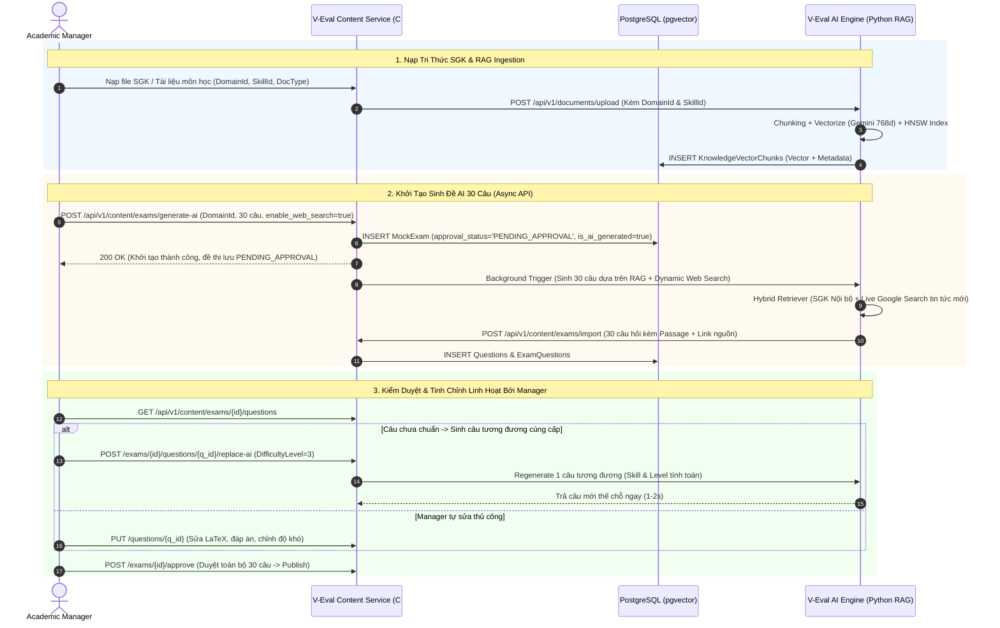

# Kế Hoạch Kiến Trúc & Triển Khai: AI Exam Generation (30 Câu), Multi-Domain Vector RAG & Quy Trình Kiểm Duyệt Đề Thi Linh Hoạt

Tài liệu này tổng hợp toàn bộ giải pháp kiến trúc hệ thống, mô hình cơ sở dữ liệu Vector RAG, luồng sinh đề thi 30 câu bất đồng bộ, cơ chế Dynamic Web Search thời sự và quy trình kiểm duyệt/tinh chỉnh linh hoạt dành cho Academic Manager.

---

## 📐 1. Kiến Trúc Luồng Tổng Quan (End-to-End Workflow)



---

## 💾 2. Thiết Kế Mô Hình Vector DB (`KnowledgeVectorChunks`)

Hệ thống sử dụng extension **`pgvector`** tích hợp trong PostgreSQL (`veval_network`), đồng bộ 100% ACID với tài liệu schema [`SQL.sql`](../../docs/SQL/SQL.sql).

### 2.1 Cấu Trúc Bảng Vector DB
```sql
CREATE TABLE "KnowledgeVectorChunks" (
  "chunk_id" uuid PRIMARY KEY DEFAULT gen_random_uuid(),
  "source_id" uuid NOT NULL REFERENCES "KnowledgeSources"("source_id") ON DELETE CASCADE,
  "domain_id" uuid REFERENCES "CompetencyDomains"("domain_id"),
  "skill_id" uuid REFERENCES "Skills"("skill_id"),
  
  "content_snippet" text NOT NULL,              -- Nội dung đoạn văn thô (~300-500 từ)
  "embedding" vector(768),                     -- Mảng Vector 768 chiều (Gemini Text-Embedding-004)
  "document_type" varchar(50) DEFAULT 'TEXTBOOK', -- 'TEXTBOOK', 'CURRICULUM', 'GENERAL_KNOWLEDGE', 'PAST_EXAM'
  
  "metadata" jsonb,                            -- Trang số, tên chương, nguồn gốc...
  "created_at" timestamp DEFAULT now()
);

-- Index HNSW phục vụ tìm kiếm Cosine Similarity cực nhanh (<5ms)
CREATE INDEX "idx_vector_hnsw" 
ON "KnowledgeVectorChunks" 
USING hnsw ("embedding" vector_cosine_ops);
```

### 2.2 So Sánh Tri Thức SGK vs Câu Hỏi Thuần
- **Tri Thức SGK / RAG Source**: Dữ liệu phi cấu trúc, được cắt đoạn và lưu dưới dạng Vector `vector(768)` để AI tra cứu ngữ cảnh lý thuyết.
- **Câu Hỏi Thuần (Questions)**: Dữ liệu có cấu trúc (`content_latex`, `option_a/b/c/d`, `correct_option`, `explanation`, `difficulty_level`) dùng trực tiếp để hiển thị thi thử và chấm điểm.

---

## 🌐 3. Cơ Chế Dynamic Web Search (Sinh Câu Hỏi Dạng Mở)

Khi sinh đề thi ĐGNL mở rộng bối cảnh thời sự (VD: *Ngành bán dẫn, AI trong Y học, Năng lượng xanh*):

1. **Flag Cấp Quyền**: API nhận parameter `"enable_web_search": true`.
2. **Hybrid Search Pipeline**:
   - **Internal Vector Search**: Quét SGK nội bộ đảm bảo đúng **Khung năng lực & Chuẩn kiến thức**.
   - **Live Web Search / Gemini Grounding**: Kéo tin tức / bài báo phát minh mới nhất trên Internet làm **Bài đọc bối cảnh (Passage)**.
3. **Trích Dẫn Nguồn (Citation)**: Tự động lưu `source_url` vào bài đọc để Academic Manager dễ dàng click kiểm tra tính thực tế và minh bạch.

---

## 🛠️ 4. Quy Trình Kiểm Duyệt & Tinh Chỉnh Của Academic Manager

Mọi đề thi AI sinh ra đều nằm ở trạng thái **`PENDING_APPROVAL`**. Academic Manager có 3 quyền hạn xử lý linh hoạt trên Dashboard:

### 4.1 Sinh Câu Tương Đương Thay Thế Tức Thì (AI Similar Replacement)
- Khi phát hiện 1 câu bị lỗi hoặc chưa hay, Manager bấm **"Sinh câu tương đương"**.
- AI Engine chỉ mất 1 - 2 giây để tạo đúng 1 câu mới thế chỗ, giữ nguyên `skill_id` và `difficulty_level`.

### 4.2 Tinh Chỉnh Cấp Độ Tính Toán & Độ Khó (Dynamic Difficulty Override)
- Manager có quyền điều chỉnh mức độ phức tạp tính toán của từng câu theo thang 4 cấp độ (Bloom Taxonomy):
  - **Level 1 (Nhận biết)**: Tính toán 1 bước.
  - **Level 2 (Thông hiểu)**: Tính toán 2-3 bước.
  - **Level 3 (Vận dụng)**: Tính toán tích hợp nhiều công thức.
  - **Level 4 (Vận dụng cao)**: Tư duy mở, biến đổi phức tạp.
- Khi chỉnh slider độ khó từ Level 2 lên Level 3 và bấm "Sinh lại", AI sẽ tự nâng độ phức tạp bài toán lên Level 3.

### 4.3 Tự Chỉnh Sửa Trực Tiếp (Manual Fine-Tuning)
- Manager có thể chỉnh sửa trực tiếp nội dung đề bài, công thức LaTeX, 4 đáp án A/B/C/D và lời giải trên giao diện.

### 4.4 Quản Lý Trạng Thái 2 Tầng
- **Tầng Câu Hỏi (`Questions.moderation_status`)**: `'PENDING'`, `'APPROVED'`, `'REJECTED'`.
- **Tầng Đề Thi (`MockExams.approval_status`)**: Chỉ khi 30/30 câu đạt `'APPROVED'`, đề thi mới chuyển sang `'APPROVED'` và `is_published = true`.

---

## 📑 5. Bảng Theo Dõi Tiến Độ Triển Khai (Progress Matrix)

| STT | Hạng Mục / Chức Năng | Vị Trí Triển Khai trong Code | Trạng Thái | Ghi Chú |
| :---: | :--- | :--- | :---: | :--- |
| 1 | **Update SQL Schema & Indexes** | [`docs/SQL/SQL.sql`](../../docs/SQL/SQL.sql) | 🟢 Hoàn thành | Bổ sung `MockExams` approval fields & `KnowledgeSources` domain/skill |
| 2 | **pgvector Ingestion Catalog** | `V-Eval-Ai_Engine/rag-service` | 🟡 Đang làm | Triển khai `KnowledgeVectorChunks` & metadata filters |
| 3 | **Async AI Exam Generator 30 câu** | `V-Eval-Content_Service/Features/Exams/` | 🟡 Đang làm | Endpoint `POST /generate-ai` trả về `PENDING_APPROVAL` |
| 4 | **Item-Level Replace API (1-2s)** | `V-Eval-Content_Service/Features/Questions/` | 🟡 Đang làm | API thay thế 1 câu tương tương cùng skill/level |
| 5 | **Dynamic Web Search Grounding** | `V-Eval-Ai_Engine/rag-service/routers/` | 🟡 Đang làm | Tích hợp Google Search API / Gemini Grounding |
