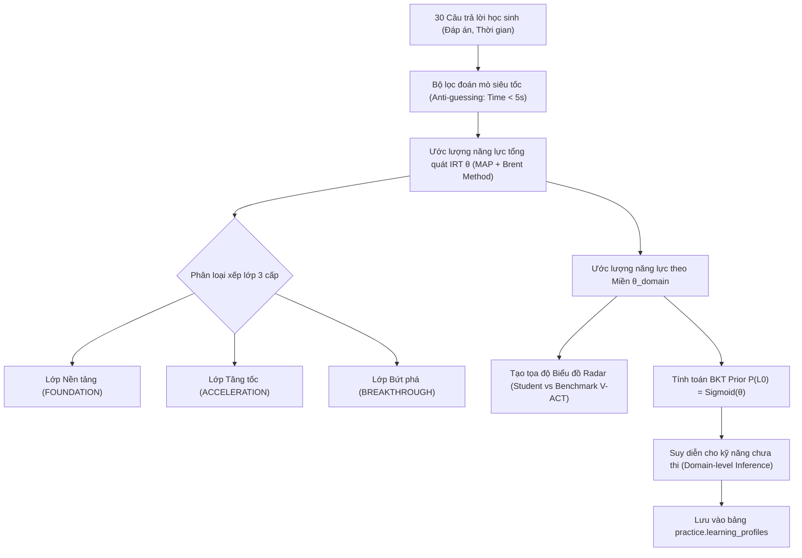

# TÀI LIỆU TOÁN HỌC & PSYCHOMETRICS: MÔ HÌNH IRT 2PL, BKT VÀ THUẬT TOÁN CHẨN ĐOÁN NĂNG LỰC ĐẦU VÀO (CORE FLOW 1)

> [!IMPORTANT]
> **Dự án:** V-Eval - Hệ thống Luyện thi Đánh giá Năng lực ĐHQG-HCM (V-ACT) tích hợp AI  
> **Module:** AI Engine (`rag-service/diagnostic_engine.py`)  
> **Ngày ban hành:** 22/09/2026  
> **Chuẩn tương thích:** MD Editor Plus / Mermaid 11.15.0+  

---

## 📑 MỤC LỤC
1. [Tổng Quan Kiến Trúc Đo Lường Năng Lực (Psychometrics Architecture)](#1-tổng-quan-kiến-trúc-đo-lường-năng-lực)
2. [Mô hình IRT 2-Parameter Logistic (2PL) Có Đoán Mò](#2-mô-hình-irt-2-parameter-logistic-2pl-có-đoán-mò)
3. [Cơ Chế Phạt Đoán Mò Siêu Tốc (Anti-Guessing Penalty)](#3-cơ-chế-phạt-đoán-mò-siêu-tốc)
4. [Ước Lượng Năng Lực Maximum A Posteriori (MAP) Với Gaussian Prior](#4-ước-lượng-năng-lực-maximum-a-posteriori-map)
5. [Sai Số Chuẩn Của Ước Lượng (Standard Error of Measurement - SEM)](#5-sai-số-chuẩn-của-ước-lượng-sem)
6. [Xác Suất Thành Thục Ban Đầu BKT Prior & Kẹp Biên An Toàn](#6-xác-suất-thành-thục-ban-đầu-bkt-prior)
7. [Heuristic Năng Lực Cho Kỹ Năng Đơn Lẻ (Single-Item Skill)](#7-heuristic-năng-lực-cho-kỹ-năng-đơn-lẻ)
8. [Cơ Chế Suy Diễn Miền Cho Kỹ Năng Chưa Thi (Domain-Level Inference)](#8-cơ-chế-suy-diễn-miền-cho-kỹ-năng-chưa-thi)
9. [Quy Tắc Phân Lớp Học Sinh 3 Cấp (Placement Classification)](#9-quy-tắc-phân-lớp-học-sinh-3-cấp)
10. [Tọa Độ Biểu Đồ Mạng Nhện (Radar Chart) Đối Chiếu Benchmark V-ACT](#10-tọa-độ-biểu-đồ-mạng-nhện-radar-chart)
11. [Quy Tắc Nhận Diện Kỹ Năng Yếu (Weak Skills Rule)](#11-quy-tắc-nhận-diện-kỹ-năng-yếu)

---

## 1. TỔNG QUAN KIẾN TRÚC ĐO LƯỜNG NĂNG LỰC

Trong bài kiểm tra chẩn đoán đầu vào (Diagnostic Test 30 câu trong 45 phút), hệ thống V-Eval kết hợp hai lý thuyết đo lường giáo dục hiện đại:
* **Item Response Theory (IRT)**: Đo lường năng lực tổng quát của học sinh dựa trên trọng số độ khó và độ phân biệt của từng câu hỏi.
* **Bayesian Knowledge Tracing (BKT)**: Khởi tạo xác suất làm chủ ban đầu cho từng kỹ năng làm nền tảng cho việc học tập thích ứng cá nhân hóa (Adaptive Learning) ở Core Flow 2.



---

## 2. MÔ HÌNH IRT 2-PARAMETER LOGISTIC (2PL) CÓ ĐOÁN MÒ

### 2.1. Biểu thức toán học
Xác suất một học sinh có năng lực `θ` trả lời đúng câu hỏi thứ `i`:

```text
P(X_i = 1 | θ) = c + (1 - c) / (1 + exp(-a_i * (θ - b_i)))
```

### 2.2. Tham số chi tiết
* `θ` (Theta): Năng lực tiềm ẩn của học sinh (Latent Trait Ability), chuẩn hóa trong khoảng `[-3.0, +3.0]`. Điểm 0.0 đại diện cho năng lực trung bình của toàn bộ tập thí sinh.
* `b_i` (Item Difficulty): Độ khó của câu hỏi thứ `i`, quy đổi từ 4 cấp độ nhận thức của hệ thống V-Eval:
  * Mức 1 (Nhận biết): `b = -1.0`
  * Mức 2 (Thông hiểu): `b = 0.0`
  * Mức 3 (Vận dụng): `b = 1.0`
  * Mức 4 (Vận dụng cao): `b = 2.0`
* `a_i` (Item Discrimination): Độ phân biệt của câu hỏi (mặc định chuẩn `a = 1.0`).
* `c` (Pseudo-Guessing): Xác suất đoán mò ngẫu nhiên. Vì đề thi ĐGNL ĐHQG-HCM sử dụng trắc nghiệm 4 lựa chọn (A, B, C, D), giá trị cố định là `c = 0.25`.

### 2.3. 🎯 Vì sao lại dùng công thức này?
1. **Khắc phục sai lệch của lý thuyết đo lường cổ điển (CTT - Classical Test Theory)**:
   * Nếu chỉ tính tỷ lệ đúng đơn thuần (ví dụ đúng 6/30 câu = 20%), hệ thống không thể biết học sinh làm đúng 6 câu RẤT KHÓ hay 6 câu RẤT DỄ.
   * IRT phân biệt rõ giá trị thông tin: làm đúng 1 câu Vận dụng cao (`b = 2.0`) chứng minh năng lực cao hơn rất nhiều so với làm đúng 1 câu Nhận biết (`b = -1.0`).
2. **Bắt buộc phải có tham số `c = 0.25`**:
   * Học sinh hoàn toàn không biết gì (`θ → -∞`) khi chọn bừa vẫn có xác suất trúng 25%. Nếu không đưa tham số `c` vào mô hình, điểm năng lực của học sinh yếu sẽ bị tính toán sai lệch nghiêm trọng.

---

## 3. CƠ CHẾ PHẠT ĐOÁN MÒ SIÊU TỐC (ANTI-GUESSING PENALTY)

### 3.1. Biểu thức toán học
```text
Nếu TimeSpent_i < 5 giây  ==>  Gán a_i = 0.1 (thay vì a_i = 1.0)
```

### 3.2. 🎯 Vì sao lại dùng công thức này?
* **Thực trạng thi trắc nghiệm**: Học sinh thường có xu hướng "đánh lụi" (click ngẫu nhiên) khi gặp câu quá khó hoặc sắp hết giờ làm bài.
* **Hậu quả nếu không có cơ chế này**: Nếu một học sinh đánh lụi trong 2 giây vào một câu hỏi Rất Khó (`b = 2.0`) và ngẫu nhiên trúng đáp án, mô hình IRT thông thường sẽ lầm tưởng học sinh này có trình độ xuất sắc và đẩy vọt điểm năng lực lên sai lệch.
* **Bản chất toán học**: Khi độ phân biệt bị ép xuống `a_i = 0.1`, hàm xác suất trở nên gần như nằm ngang (phẳng lì), đạo hàm triệt tiêu dẫn đến lượng thông tin Fisher của câu hỏi đó tiến về 0:
```text
I_i(θ) ≈ 0
```
Nhờ đó, câu trả lời ăn may hoàn toàn không làm sai lệch năng lực thực tế của học sinh.

---

## 4. ƯỚC LƯỢNG NĂNG LỰC MAXIMUM A POSTERIORI (MAP)

### 4.1. Biểu thức toán học
Hàm mục tiêu tìm kiếm điểm năng lực tối ưu `θ̂_MAP`:

```text
θ̂_MAP = argmax_{θ ∈ [-3.0, 3.0]} [ ln L(θ) - (θ² / 8.0) ]
```

Trong đó:
* **Hàm Log-Likelihood thực tế**:
```text
ln L(θ) = ∑ [ u_i * ln(P_i(θ)) + (1 - u_i) * ln(1 - P_i(θ)) ]
```
*(với `u_i = 1` nếu học sinh trả lời đúng, `u_i = 0` nếu trả lời sai).*
* **Hàm Tiên Nghiệm Gaussian Prior**:
```text
p(θ) ~ N(0, σ² = 2.0²)  ==>  ln p(θ) = -θ² / (2 * 2.0²) = -θ² / 8.0
```

### 4.2. 🎯 Vì sao lại dùng công thức này?
1. **Khắc phục lỗi vô nghiệm của Maximum Likelihood Estimation (MLE) thuần túy**:
   * Khi học sinh làm **đúng 100%** (30/30 câu): MLE thuần túy sẽ chia cho 0 và đẩy `θ → +∞`.
   * Khi học sinh làm **sai 100%** (0/30 câu): MLE thuần túy sẽ đẩy `θ → -∞`.
2. **Tác dụng của Gaussian Prior**:
   * Đóng vai trò như thành phần chuẩn hóa L2 (L2 Regularization / Shrinkage), giữ điểm ước lượng ổn định trong biên toán học an toàn `[-3.0, +3.0]`.
3. **Giải thuật tối ưu hóa Brent (`scipy.optimize.minimize_scalar`)**:
   * Tìm cực trị hàm 1 biến bằng cách kết hợp nội suy Parabol và phương pháp chia đôi (Golden-section search), đảm bảo hội tụ tới nghiệm toàn cục chính xác chỉ trong `< 5ms`.

---

## 5. SAI SỐ CHUẨN CỦA ƯỚC LƯỢNG (SEM)

### 5.1. Biểu thức toán học
```text
SE(θ̂) = 1 / sqrt( I(θ̂) + 0.25 )
```

Với hàm thông tin Fisher (Fisher Information):
```text
I(θ) = ∑ [ (P'_i(θ))² / (P_i(θ) * (1 - P_i(θ))) ]
```
Đạo hàm cấp 1 của hàm IRT 2PL:
```text
P'_i(θ) = (1 - c) * a_i * [ exp(-a_i * (θ - b_i)) / (1 + exp(-a_i * (θ - b_i)))² ]
```

### 5.2. 🎯 Vì sao lại dùng công thức này?
* Điểm số của con người không phải là giá trị tuyệt đối không đổi.
* `SE(θ̂)` cung cấp khoảng tin cậy của năng lực học sinh (Confidence Interval: `[θ̂ - 1.96*SE, θ̂ + 1.96*SE]`). Nếu bài thi có độ khó phân bổ phù hợp với học sinh, hàm thông tin `I(θ)` đạt cực đại và sai số `SE` nhỏ nhất, khẳng định bài khảo sát có độ chính xác cao.

---

## 6. XÁC SUẤT THÀNH THỤC BAN ĐẦU BKT PRIOR

### 6.1. Biểu thức toán học
Chuyển đổi năng lực IRT (thang logit trừu tượng `[-3, +3]`) sang xác suất thành thục ban đầu của kỹ năng:

```text
P(L_0) = Sigmoid(θ_skill) = 1 / (1 + exp(-θ_skill))
P(L_0)_clamped = max(0.05, min(0.95, P(L_0)))
```

### 6.2. 🎯 Vì sao lại dùng công thức này?
1. **Ánh xạ Logit sang Xác suất**:
   * Mô hình Bayesian Knowledge Tracing (BKT) yêu cầu giá trị đầu vào là xác suất làm chủ kỹ năng ban đầu `P(L_0) ∈ (0, 1)`.
   * Hàm Logistic Sigmoid chuyển đổi mượt mà giữa hai không gian:
     * `θ = 0.0` (Trung bình) $\implies$ `P(L_0) = 0.50` (50% thành thạo).
     * `θ = +2.5` (Khá giỏi) $\implies$ `P(L_0) = 0.9241` (~92% thành thạo).
     * `θ = -2.5` (Yếu) $\implies$ `P(L_0) = 0.0759` (~7.6% thành thạo).
2. **Kẹp biên an toàn `[0.05, 0.95]` (Clamping Rule)**:
   * Trong chuỗi Markov ẩn (HMM) của thuật toán BKT, công thức cập nhật xác suất có dạng:
     ```text
     P(L_t | Đúng) = P(L_{t-1}) * (1 - Slip) / [ P(L_{t-1}) * (1 - Slip) + (1 - P(L_{t-1})) * Guess ]
     ```
   * Nếu để `P(L_0) = 0.0` hoặc `P(L_0) = 1.0`, mẫu số bị triệt tiêu dẫn đến thuật toán bị **đóng băng vĩnh viễn** (không bao giờ tăng hoặc giảm điểm được nữa). Khoảng kẹp `[0.05, 0.95]` đảm bảo học sinh luôn có cơ hội tiến bộ khi làm thêm bài tập.

---

## 7. HEURISTIC NĂNG LỰC CHO KỸ NĂNG ĐƠN LẺ

### 7.1. Biểu thức toán học
Áp dụng cho các kỹ năng chỉ có duy nhất 1 câu hỏi trong bài thi chẩn đoán:

```text
θ_skill = θ_domain + 0.3  (nếu trả lời ĐÚNG)
θ_skill = θ_domain - 0.3  (nếu trả lời SAI)
```

### 7.2. 🎯 Vì sao lại dùng công thức này?
* Khi chỉ có 1 câu hỏi đơn lập, bài toán tối ưu hóa IRT không đủ điểm dữ liệu để hội tụ (Overfitting).
* Công thức này **neo kỹ năng con vào năng lực chung của cả Miền cha** (`θ_domain`), sau đó thưởng hoặc phạt một lượng vừa phải `±0.3` (tương đương ~0.3 độ lệch chuẩn năng lực) dựa trên kết quả câu hỏi đó.

---

## 8. CƠ CHẾ SUY DIỄN MIỀN CHO KỸ NĂNG CHƯA THI

### 8.1. Biểu thức toán học
Với kỹ năng `s` thuộc miền năng lực `d` không có câu hỏi nào trong bài khảo sát 30 câu:

```text
θ_s = θ_domain_d
P(L_0)_s = Sigmoid(θ_domain_d)
Source = "inferred_from_domain"
```

### 8.2. 🎯 Vì sao lại dùng công thức này?
* **Giải quyết bài toán Khởi động lạnh (Cold-Start)**: Đề thi rút gọn 30 câu chỉ kiểm tra được 12 kỹ năng đại diện, trong khi toàn hệ thống có hơn 134 kỹ năng.
* Nếu học sinh làm rất tốt các câu Tiếng Anh có trong đề (`θ_English = +1.5`), hệ thống tự động suy luận rằng các kỹ năng Tiếng Anh khác (dù chưa thi) cũng có mức thành thạo ban đầu tương ứng, tránh việc để trống hoặc gán mặc định 0% gây lệch lạc lộ trình học thích ứng.

---

## 9. QUY TẮC PHÂN LỚP HỌC SINH 3 CẤP

### 9.1. Biểu thức toán học
```text
- Nếu θ̂_0 < -0.5             ==>  Lớp Nền tảng (FOUNDATION)
- Nếu -0.5 ≤ θ̂_0 ≤ 0.5       ==>  Lớp Tăng tốc (ACCELERATION)
- Nếu θ̂_0 > 0.5              ==>  Lớp Bứt phá (BREAKTHROUGH)
```

### 9.2. 🎯 Vì sao lại phân chia theo các ngưỡng này?
Dựa trên tích phân diện tích của hàm phân phối chuẩn Gauss `N(0, 1)`:
* Khoảng `[-0.5, +0.5]` chiếm khoảng **38.3%** học sinh (năng lực trung bình khá) $\implies$ Phù hợp vào lớp **Tăng tốc** để luyện giải đề và tăng phản xạ tốc độ.
* Khoảng `θ < -0.5` chiếm khoảng **30.85%** học sinh (bị hổng kiến thức căn bản) $\implies$ Phù hợp vào lớp **Nền tảng** để ôn lại lý thuyết trọng tâm.
* Khoảng `θ > 0.5` chiếm khoảng **30.85%** học sinh (khá giỏi) $\implies$ Phù hợp vào lớp **Bứt phá** để rèn luyện câu hỏi vận dụng cao.

---

## 10. TỌA ĐỘ BIỂU ĐỒ MẠNG NHỆN (RADAR CHART)

### 10.1. Biểu thức toán học
```text
StudentPct_d = (Tổng câu đúng trong miền d / Tổng câu hỏi trong miền d) * 100%
BenchmarkPct = (TargetScore / 1200) * 100%
```

### 10.2. 🎯 Vì sao lại dùng công thức này?
* Kỳ thi ĐGNL ĐHQG-HCM có thang điểm tối đa cố định là **1200 điểm**.
* Mỗi học sinh có một mục tiêu cá nhân (ví dụ: mục tiêu 800/1200 điểm để trúng tuyển ngành mong muốn).
* Tỷ lệ `(800 / 1200) * 100% = 66.67%` tạo ra một **Vòng tròn chuẩn mực tiêu (Benchmark Polygon)**. Khi vẽ đối chiếu trên biểu đồ mạng nhện, học sinh và phụ huynh nhìn thấy ngay lập tức: môn nào đã vượt chuẩn (màu xanh), môn nào còn dưới chuẩn cần bổ sung gấp (màu đỏ).

---

## 11. QUY TẮC NHẬN DIỆN KỸ NĂNG YẾU

### 11.1. Biểu thức toán học
```text
IsWeak = True  nếu  AccuracyPct_skill < 60.0%
```

### 11.2. 🎯 Vì sao lại dùng công thức này?
* Ngưỡng 60% là tiêu chuẩn sư phạm phổ biến để phân định giữa "Đạt yêu cầu" và "Cần cải thiện".
* Kỹ năng rơi vào danh sách `weakSkills` sẽ được hệ sinh thái RAG và AI Tutor ưu tiên:
  1. Gợi ý tài liệu lý thuyết, công thức và bài giải mẫu tương ứng.
  2. Bốc bài tập thích ứng cá nhân hóa ở mức độ Nhận biết $\to$ Thông hiểu để học sinh luyện tập bù đắp lỗ hổng.
